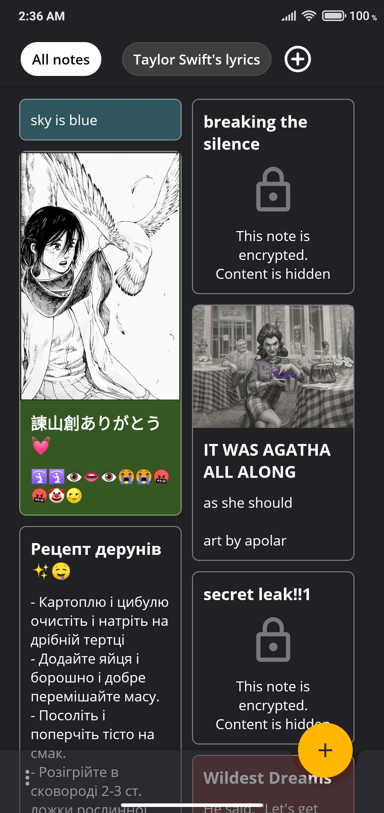
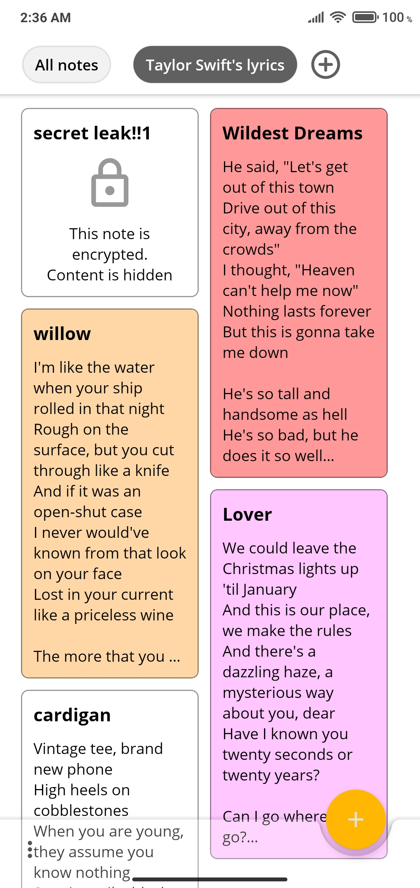
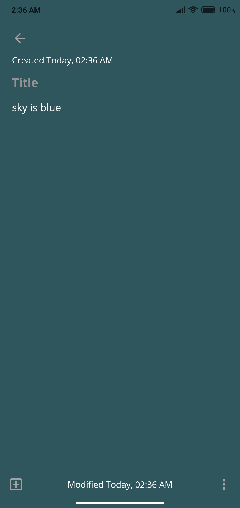

# Encrypted Notes 

Encrypted Notes is open source note-taking app for Android.

### Download

[Latest release](https://github.com/vzcatus13/EncryptedNotes/releases/latest)

### Main Features

* Encrypt note's content with AES-256 GCM PBKDF2
* Search, change the color of the note or add one (1) image to note
* Create notebooks (folders) and save notes there.
* Backup or restore notes to/from device storage
* The night (dark) theme is supported

### Screenshots

|  |  |  |
|---|---|---|

### Acknowledgements

* Icon for app designed by Pixel perfect from [Flaticon](https://www.flaticon.com/free-icon/notebook_2312356)

### Why?
Why it's here? There's a lot of note-taking apps! 
First of all, it's my first app on Android ever. I was learning [the Android fundamentals course](https://google-developer-training.github.io/android-developer-fundamentals-course-concepts-v2/) by the Google Developers Training team, but just reading and doing small example apps was boring, so experimenting with the more complex app was more interesting. 
Secondly, I wanted to record my dreams. Also, I wanted that nobody can read them, except me. So I have two options: create a new alphabet or an Android app with encryption. I selected the last option. Before creating the app I found similar apps like [Safe Notes](https://play.google.com/store/apps/details?id=com.protectedtext.android) (which is very good, but the design quite old) and [PotatoNotes](https://play.google.com/store/apps/details?id=com.potatoproject.notes) (which have good design, password protection, but the content is saved in plaintext).